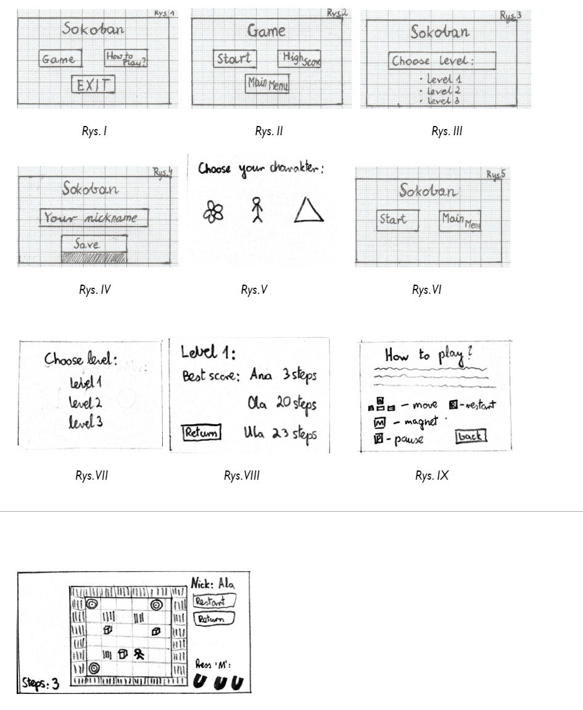

# Główne menu w grze 

W podstawowym oknie aplikacji gry `Sokoban` znajduje się menu wstępne z przedstawionym logo gry oraz trzema opcjami:  

* Game, 
* How to Play?, 
* Exit; 

Główne menu gry jest przedstawione na rys. 1, dalej będziemy oznaczać je jako A. 

# Opis podmenu w grze 
* <b>Podmenu Game:</b>

Po naciśnięciu opcji Game możemy wybrać:

* Start,  
* High Scores,  
* Main Menu (główne menu gry przedstawione na rys.1, A);  

Podmenu Game jest przedstawione na rys. II, dalej będziemy oznaczać je jako B. 

* Start:

Po wybraniu opcji Start w nowym oknie następuje wybór poziomu (przedstawione na rys. III). Po wyborze poziomu gracz ma <b>możliwość wpisania nazwy użytkownika</b> w nowoutworzonym oknie (rys. IV). Po zatwierdzeniu wyboru nicku otwiera się kolejne okno, <b>w którym użytkownik ma możliwość personalizacji bohatera</b> (rys. V). Po podwójnym kliknięciu na okienko bohatera, otwiera się nowe okno (rys. VI), w którym użytkownik może podjąć decyzję o rozpoczęciu gry albo ostatecznym wyjściu do menu głównego (ozn. A). 

* High Scores:

Naciśnięcie opcji High Scores powoduje wywołanie okna z listą poziomów (rys. VII). Następnie użytkownik może zobaczyć wyniki dla poszczególnych poziomów (rys. VIII). Przycisk return umożliwia powrót do podmenu Game (ozn. B). 

* Main Menu:

Opcja Main Menu zwraca użytkownika do menu głównego(ozn. A). 

* <b>Podmenu How to Play?: </b>

Opcja How to Play? (rys. IX) w menu głównym zapoznaje użytkownika ze szczegółowymi zasadami gry oraz punktacją w grze Sokoban. 

* <b>Podmenu Exit: </b>

Opcja menu „Exit” kończy działanie programu. 

# Szczegółowe zasady gry oraz punktacja: 

Gra Sokoban jest <b>grą logiczną</b> polegającą na rozwiązaniu zadanego problemu przy jak najmniejszej liczbie ruchów, i jak najkrótszym czasie. Na planszy znajdują się miejsca, które są przeznaczone dla ruchomych bloków. Zadaniem zawodnika jest <b>przesunięcie wszystkich klocków w odpowiednie miejsca.</b> Specyfika gry wymusza od użytkownika analityczne myślenie i szybkość podejmowanych działań. Gracz sterując swoją postacią, za pomocą strzałek klawiatury, przesuwa specjalne bloki we wcześniej wyznaczone pola. Każdy wykonany krok zostaje zliczany, a ilość ruchów jest wyświetlana w lewym dolnym rogu planszy. Na podstawie tych danych <b>jest tworzona lista rankingowa</b> po zakończeniu gry (ozn. E). W przypadku złego ruchu albo braku możliwości kontynuowania gry z powodu zablokowania klocka, gracz dysponuje przyciskiem „magnet” (przycisk ‘M’ na klawiaturze), który <b>aktywuje możliwość przesunięcia dowolnie wybranego klocka o jedną kratkę.</b> Do wyniku gracza zostaje jednak dodany wtedy punkt karny.  W trakcie gry gracz dysponuje trzema magnesami. Warunkiem ukończenia poziomu <b>jest przesunięcie wszystkich bloków w wyznaczone miejsca.</b> Użytkownik może wyjść z gry do podmenu Game (rys. B) po kliknięciu przycisku ‘Exit” w prawym rogu okna planszy.   

| |
